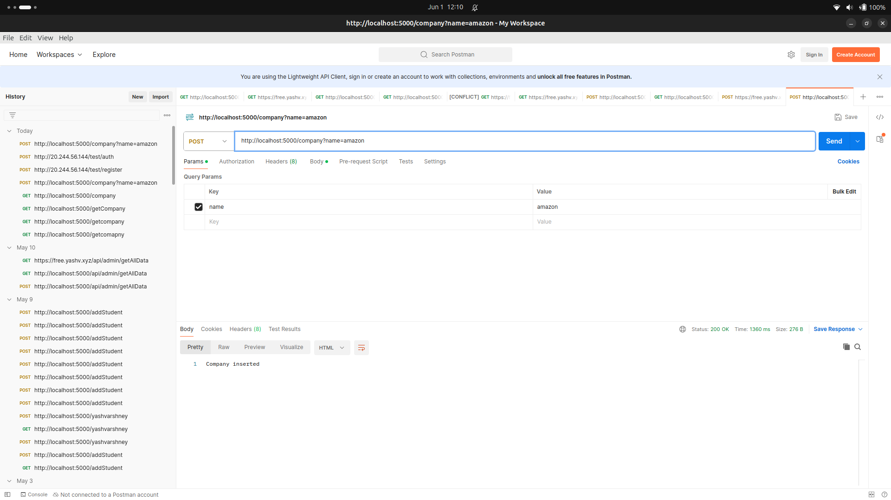
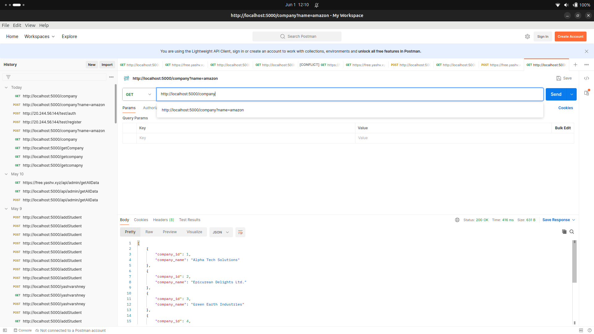
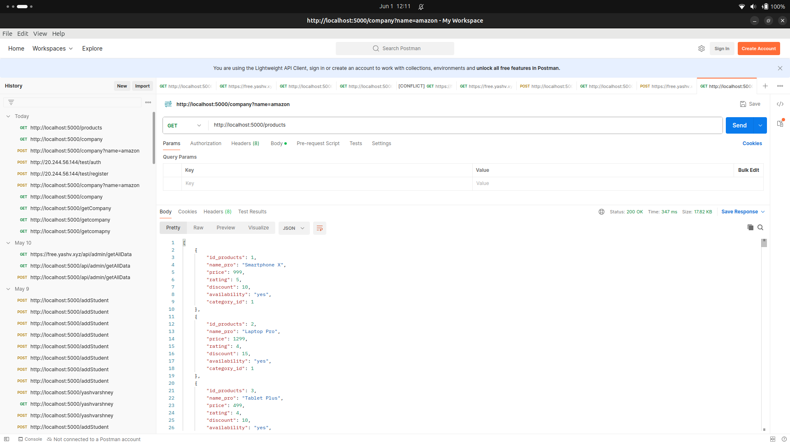
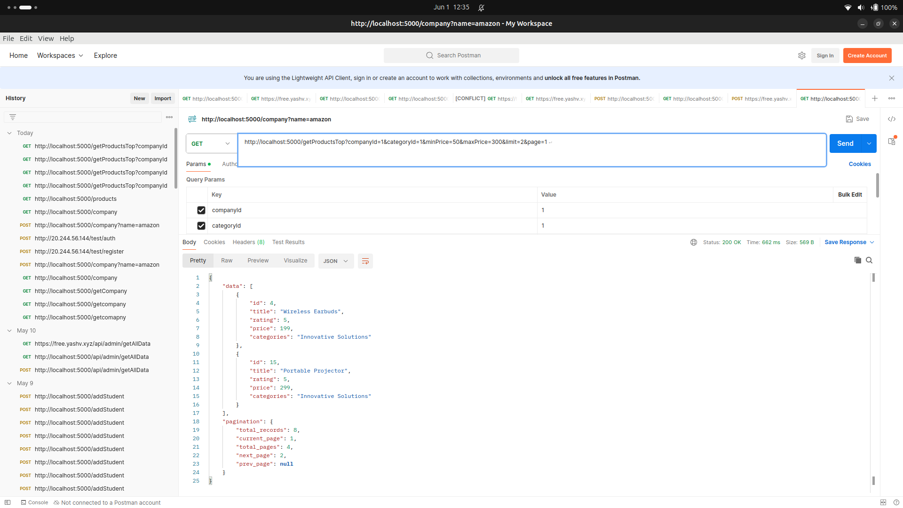

# Project Name

Question 1


## Installation

1. Clone the repository:

    ```bash
    git clone <repository_url>
    ```

2. Install the dependencies:

    ```bash
    npm install
    ```

## Usage

1. Start the server:

    ```bash
    npm start
    ```

2. Access the API endpoints:

    ```bash
    http://localhost:5000
    ```







